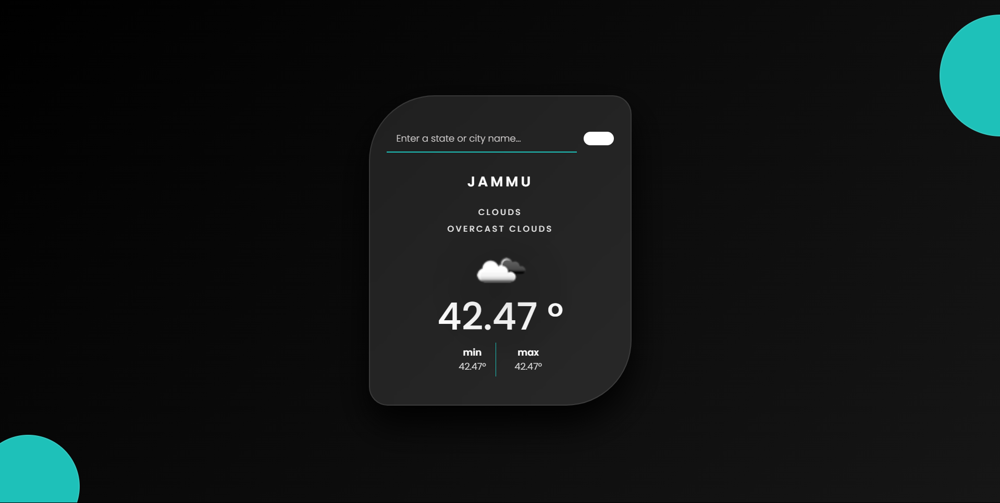

# ⛅ Weather App — JavaScript + OpenWeatherMap API

This is a simple and responsive **Weather Web Application** built using **HTML**, **CSS**, and **JavaScript**, powered by the **OpenWeatherMap API**.  
It allows users to search for any city and get live weather data, including temperature, humidity, and weather conditions.

🌐 **Live Demo:** [https://rohitsaw6207.github.io/Weather/](https://rohitsaw6207.github.io/Weather/)

---

## 🖼 Preview

---

## 📌 Features

- 🌍 Search weather by city name
- 🌡 Displays current temperature in °C
- 💧 Shows humidity levels
- 🌥 Provides a short weather description (e.g., Clear, Clouds, Rain)
- 🖼 Displays weather condition icon
- 📱 Fully responsive for mobile and desktop

---

## 🛠 Technologies Used

- **HTML5** — structure of the app  
- **CSS3** — styling and layout  
- **JavaScript** — functionality and API integration  
- **OpenWeatherMap API** — to fetch live weather data (API key: `2ebe75e4ac6e9bfe0347cb4ec9f4d669`)  
- **GitHub Pages** — for deployment  

---

## 🚀 How to Use

1️⃣ Open the live demo: [https://rohitsaw6207.github.io/Weather/](https://rohitsaw6207.github.io/Weather/)  
2️⃣ Enter the name of any city in the search box  
3️⃣ View live weather details instantly  

---

## 📌 Note

- The app uses **OpenWeatherMap's free API tier**, so request limits apply.
- API key is hardcoded for learning/demo purposes — in production, you should secure your API keys.

---

## 🧑‍💻 Author

- **Rohit Kumar Saw**  
- 📧 [rohitku6207@gmail.com](mailto:rohitku6207@gmail.com)  
- 🔗 [LinkedIn](https://www.linkedin.com/in/rohit-kumar-saw6207/)  
- 💻 [GitHub](https://github.com/Rohitsaw6207)

---

## ⭐ Support

If you like this project, consider starring ⭐ the repository to support and inspire more work!
